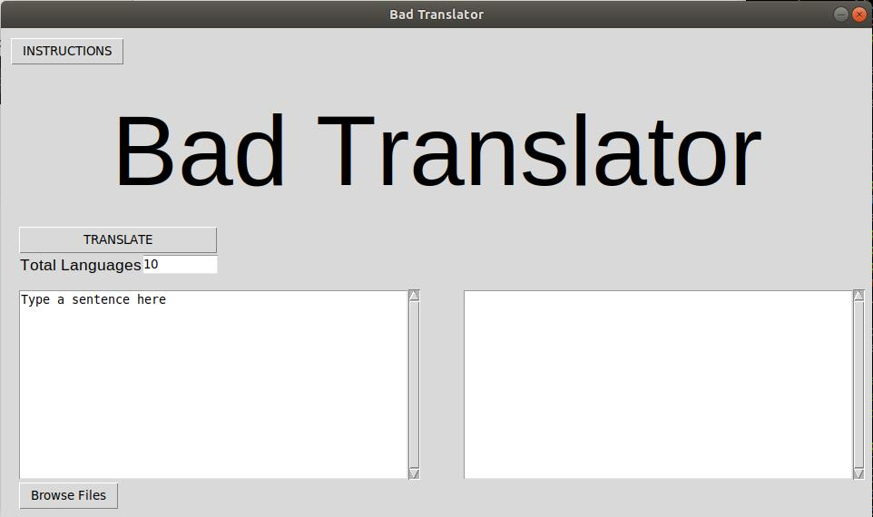

# Bad Translator

> Play telephone with Google Translate — intentionally mangled English guaranteed.

[](https://github.com/cjstahoviak/Bad-Translator/actions/workflows/ci.yml)
[](https://www.python.org/downloads/)
[](LICENSE)

Bad Translator takes your English text, runs it through a configurable number of random languages via Google Translate, then translates back to English. The compounding translation errors produce hilariously broken output — the more hops, the worse the result.



---

## Download

Pre-built executables (no Python required) are available on the [**Releases page**](https://github.com/cjstahoviak/Bad-Translator/releases):

| Platform | File |
|----------|------|
| Windows  | `Bad-Translator.exe` |
| macOS    | `Bad-Translator` |
| Linux    | `Bad-Translator` |

---

## Run from Source

### Requirements

- Python 3.10+
- pip

### Install

```bash
git clone https://github.com/cjstahoviak/Bad-Translator.git
cd Bad-Translator
pip install -e .
```

### Launch the GUI

```bash
bad-translator-gui
```

### Use the CLI

```bash
# Translate text directly
bad-translator "To be or not to be, that is the question."

# Specify the number of language hops (default: 10)
bad-translator -n 5 "Hello, world!"

# Translate a text file
bad-translator -f Examples/Gnome.txt

# Pipe from stdin
echo "Something profound" | bad-translator

# Skip spell correction
bad-translator --no-spell "intentionall typo survives"

# Show help
bad-translator --help
```

---

## How It Works

1. Input text is spell-corrected to prevent API errors from typos.
2. The text is translated through **N** randomly selected languages (default: 10).
3. The result is translated back to English.

Each hop compounds the errors of the last, producing increasingly nonsensical output. The language chain is displayed so you can see the path taken.

**Example:**
```
English → Japanese → Swahili → Arabic → Finnish → Dutch → Korean → Welsh → Turkish → Hungarian → English

Input:  "To be or not to be, that is the question."
Output: "Being or not existing, this is the problem."
```

---

## Development

```bash
# Install with dev dependencies
pip install -e ".[dev]"

# Run tests
pytest

# Run linter
ruff check src/ tests/
```

### Project Structure

```
Bad-Translator/
├── .github/workflows/
│   ├── ci.yml          # Lint + test on push/PR
│   └── release.yml     # Build executables + GitHub Release on tag
├── src/bad_translator/
│   ├── core.py         # Translation engine (shared by GUI and CLI)
│   ├── cli.py          # Command-line interface
│   └── gui.py          # CustomTkinter desktop GUI
├── tests/
│   ├── test_core.py    # Unit tests for the engine
│   └── test_cli.py     # Unit tests for the CLI
├── Examples/           # Sample text files
├── pyproject.toml      # Project metadata and dependencies
└── bad_translator.spec # PyInstaller build spec
```

### Cutting a Release

```bash
git tag v2.0.1
git push origin v2.0.1
```

The `release.yml` workflow automatically builds executables for Windows, macOS, and Linux and attaches them to a new GitHub Release.

---

## Dependencies

| Package | Purpose |
|---------|---------|
| [`translators`](https://pypi.org/project/translators/) | Free multi-engine translation (Google, Bing, DeepL, etc.) |
| [`pyspellchecker`](https://pypi.org/project/pyspellchecker/) | Spell correction before translation |
| [`customtkinter`](https://pypi.org/project/customtkinter/) | Modern-looking Tkinter GUI framework |
